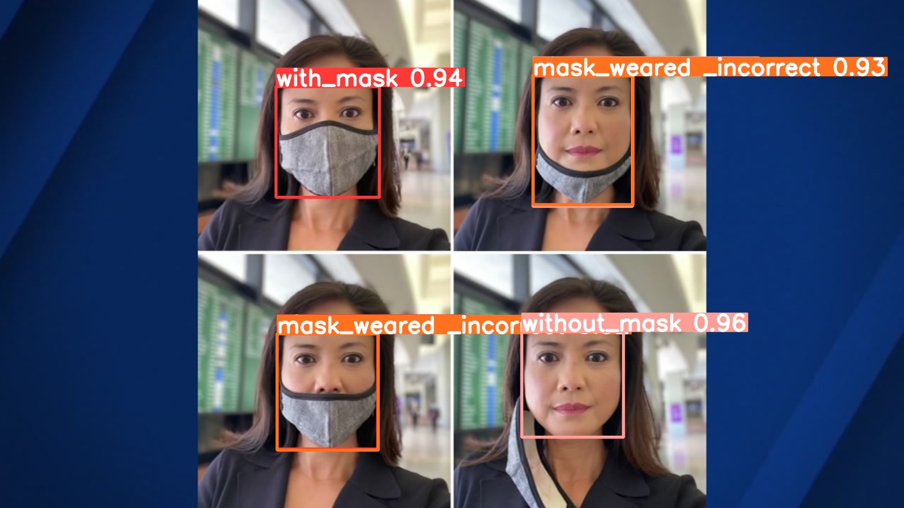
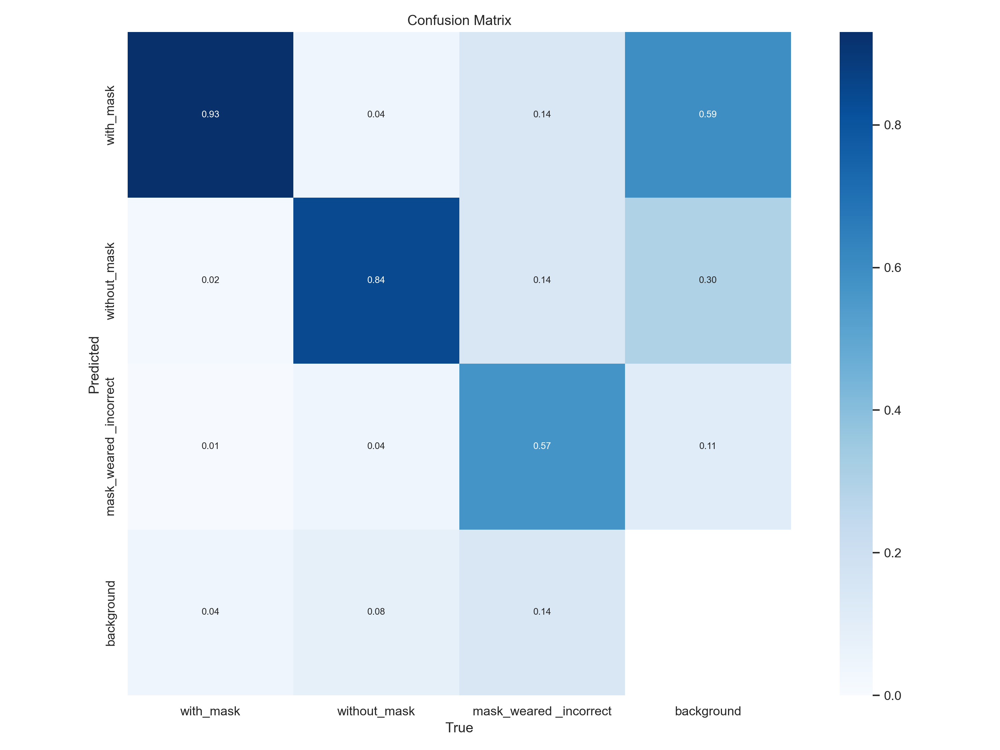
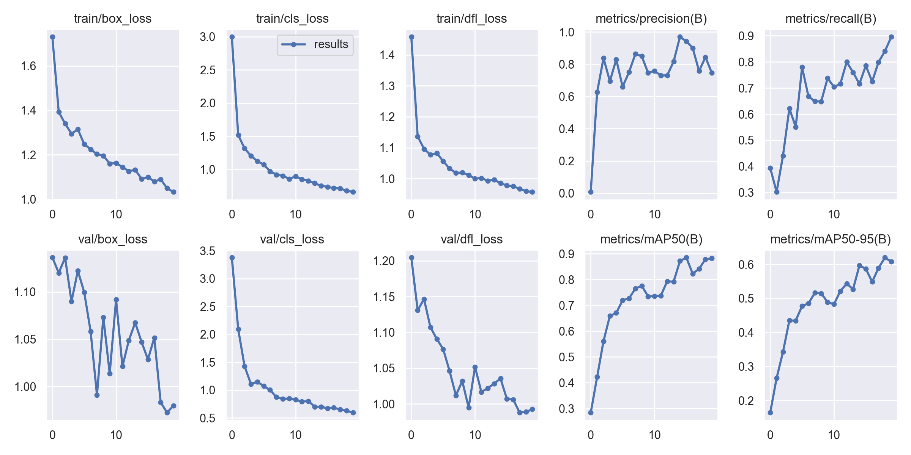
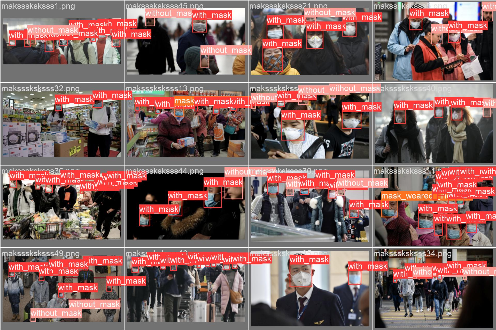
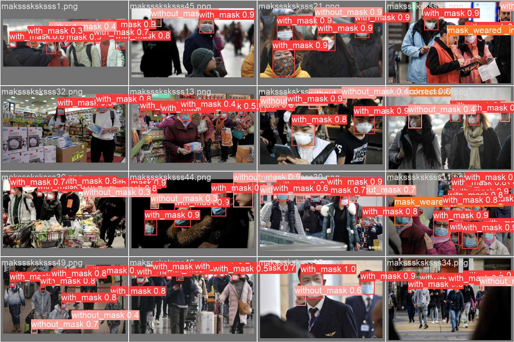

# Mask-Detector [YOLOv8]


A Realtime Mask-detector model created with yolov8


## Packages used
* ultralytics
* PyTorch 2.0
* ipykernel
* OpenCV
* labelImg(not necessary)

**Dataset that was used to train the model https://www.kaggle.com/datasets/andrewmvd/face-mask-detection**

### Modifiying Data

The data was in Xml annotation Labels but yolo require txt format<br>
So converting them to yolo format using the foolowing code:[`refrence`](https://gist.github.com/Amir22010/a99f18ca19112bc7db0872a36a03a1ec)

## Setting Up Pytorch
_I would recoomend you to check official Pytorch website to install it_<br>
**The Pytorch need the exact version of Cuda to work normally**<br>
Pytorch website: [`pytorch`](https://pytorch.org/get-started/locally/)


### Install all Packages
Either clone my repo or download the zip or copy paste the code and run them<br>
Github clone Link: https://github.com/harikris001/Mask-Detector.git <br>
Run: ```pip install -r requirments.txt```

## Creating Virtual Environment:
setting up a virtual environment will really help in Creating a seperatiion wwithin your workspace and PC<br>
**Run following to create a virtual environment**
* launch cmd 
* move to your desired directory
* Run the following:
```python -m venv yolo```
* activate your virtual env using following:<br>
```.\yolo\Scripts\activate```<br>
to deactivte just type _deactivate_ in cmd
## Creating a New kernel in Jupyter Notebook
After installing Ipykernal run the following:<br>
```python -m ipykernal install --user --name=yolo```<br>
##### _note: the name of kernel should be same as venv name_

to launch jupyter notebooks ```jupyter notebook``` in cmd<br>

## Outputs
**Confusion Matrix**
<br>
**Graphs**
<br>
**Expected Prediction**
<br>
**Model prediction Result**
<br>


### Refrences:
* [`Yolo Documentation`](https://docs.ultralytics.com/quickstart/)
* StackOverflow
* [`OpenCv Documentation`](https://docs.opencv.org/4.x/d6/d00/tutorial_py_root.html)
